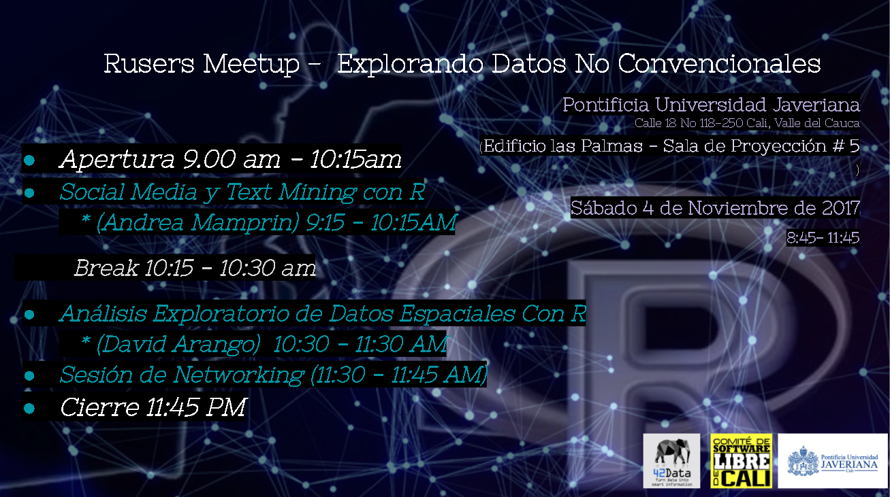
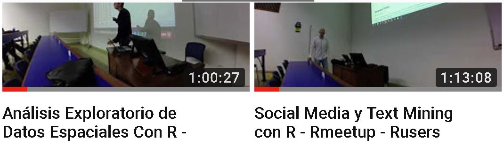

# Rusers Meetup Noviembre 2017
camiloherrera.co - 42data.co  
11 de noviembre de 2017  

 

En este repositorio encontraras todas las presentaciones utilizadas el dia 04 de noviembre de 2017.

 En este playlist se encuentra en video todas las presentaciones

[         Social Media y Text Mining con R      ](https://www.youtube.com/watch?v=zyN8CvVnMKI)

[         Análisis Exploratorio de Datos Espaciales Con R     ](https://www.youtube.com/watch?v=6YXW9z5d2Jo)

  
 
 
Te esperamos en proximos Meetups. 

# Rusers Meetup Agosto 2017
camiloherrera.co - 42data.co  
25 de agosto de 2017  

 

En este repositorio encontraras todas las presentaciones utilizadas el dia 19 de agosto de 2017.

 

 En este playlist se encuentra en video todas las presentaciones

 
[         Presentaciones en Video       ](https://www.youtube.com/playlist?list=PLC7clAL9PNlBpT5wiUQFNjsHy4-bCwmsQ)

 
 
 
 
Te esperamos en proximos Meetups. 

Recuerda que puedes proponer temas a presentar a ch@camiloherrera.co o por medio del grupo de usuarios en facebook o en meetup.com.

Saludos.
